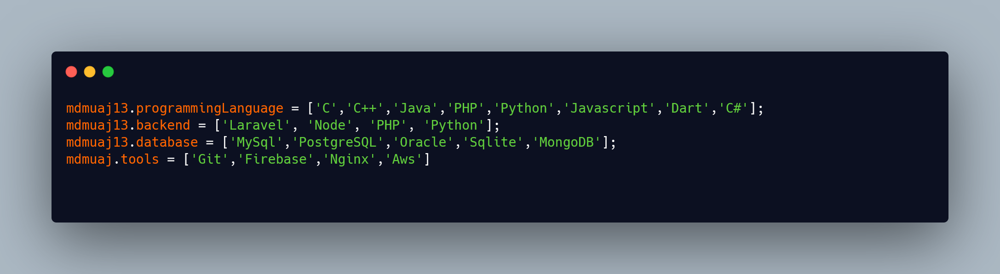

### Hi there 👋

<!--
**mdmuaj13/mdmuaj13** is a ✨ _special_ ✨ repository because its `README.md` (this file) appears on your GitHub profile.

Here are some ideas to get you started:

- 🔭 I’m currently working on ...
- 🌱 I’m currently learning ...
- 👯 I’m looking to collaborate on ...
- 🤔 I’m looking for help with ...
- 💬 Ask me about ...
- 📫 How to reach me: ...
- 😄 Pronouns: ...
- ⚡ Fun fact: ...
-->

# Hola, I'm Mohaiminul Hasan 
Human Being. That's it nothing more.

- 👨‍💼 Currently working as a Backend Developer 🏢 Landknock Ltd
- 🌱 Learning Node, Native Android
- 🙌 Practiceing Laravel, Node & Flutter

- 💬 Ask me about Laravel, Flutter  

⚡

🙋 Contact

 
    
   
  

  

